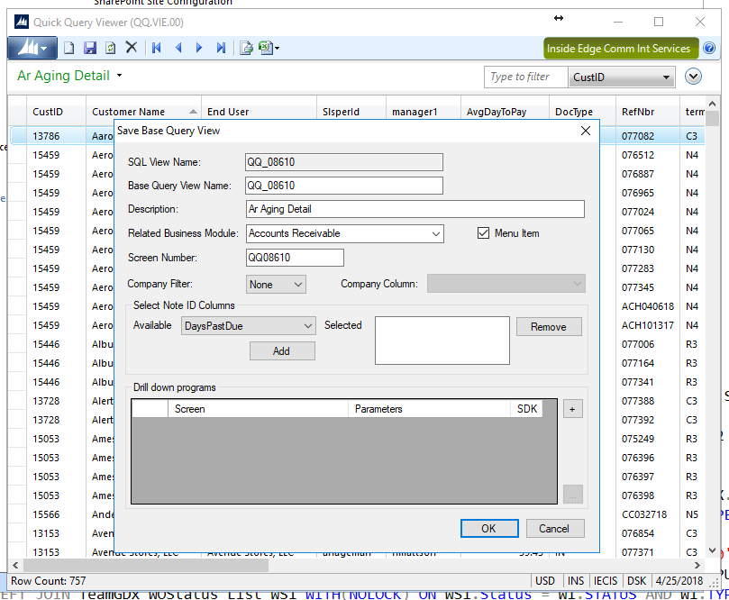
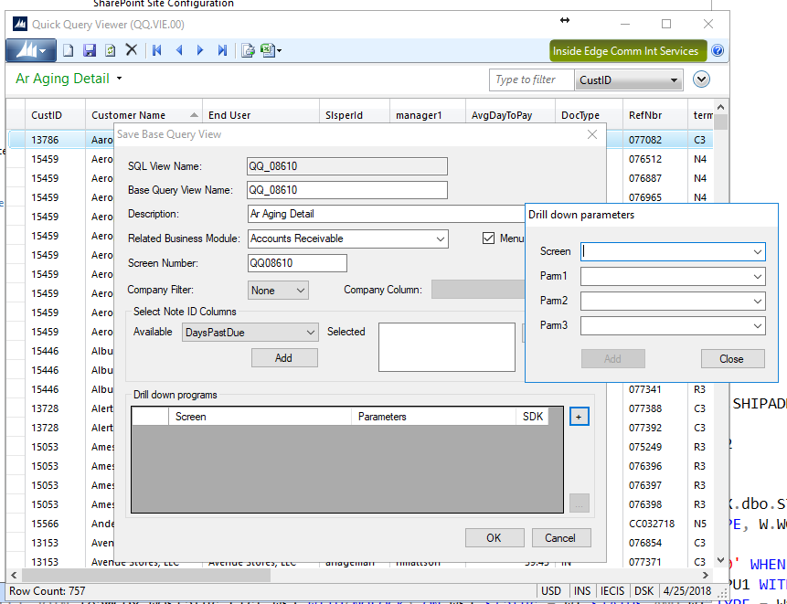
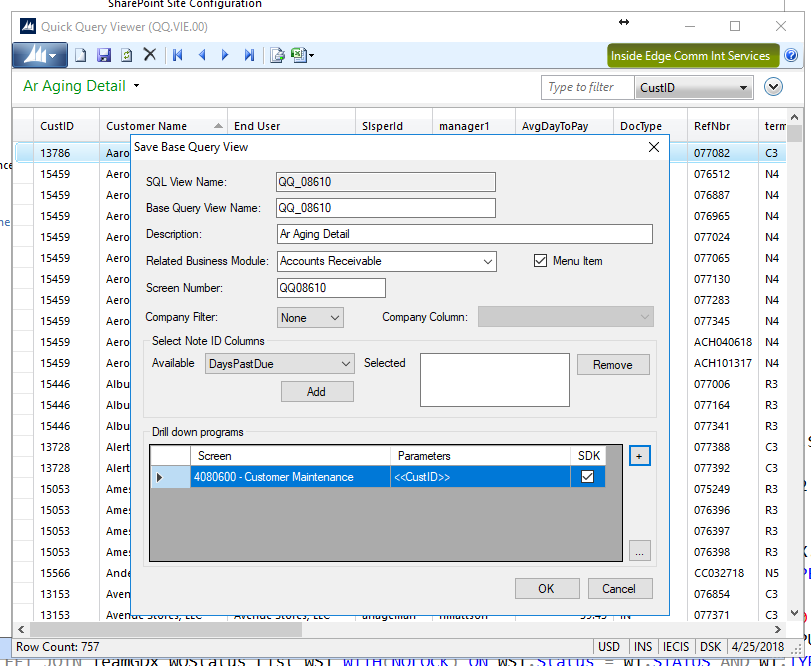

## Adding Drill Down to a Quick Query 

In Dynamics SL under Administration, there is an option for **Quick Query Viewer**.

Select the Quick Query you are editing from the green drop down menu.

Once you select **Save** the following dialog box appears:

In the lower portion of the window there is a section for **Drill down programs**.

The options for drill down parameters are two-fold:
1. Screen (number and name)
2. Parameter(s) needed to select a record in that screen

With the screen and column for the key fields selected, the quick query will allow an option to drill down to 1 or more screens when right-clicking on a row.
